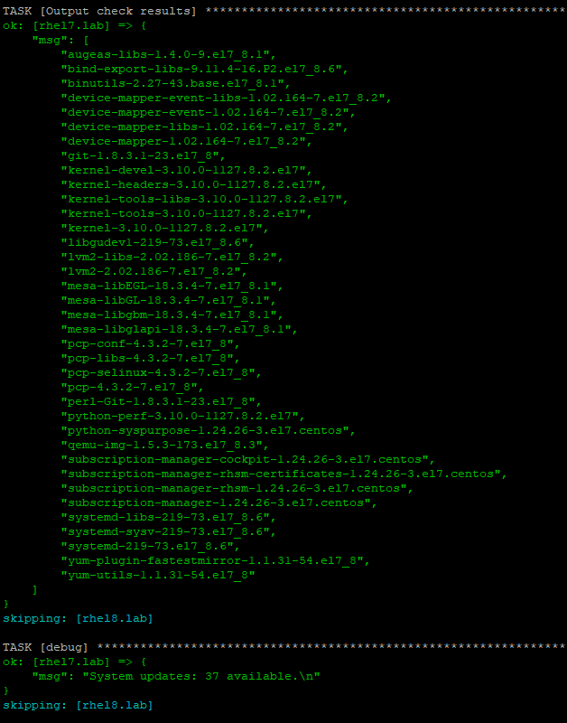
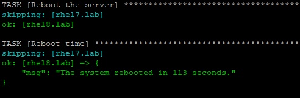

[](https://www.gnu.org/licenses/gpl-3.0)

# Update CentOS/RHEL

Copyright (C) 2019 Dmitriy Prigoda <deamon.none@gmail.com> 
This script is free software: Everyone is permitted to copy and distribute verbatim copies of 
the GNU General Public License as published by the Free Software Foundation, either version 3
of the License, but changing it is not allowed.

  Протестировано на:
- CentOS 8 
- Ansible = 2.9.5

Установка обновлений CentOS/RHEL с помощью Ansible
--------------------------------------------------

### Содержание
- [Update CentOS/RHEL](#update-centosrhel)
  - [Установка обновлений CentOS/RHEL с помощью Ansible](#установка-обновлений-centosrhel-с-помощью-ansible)
    - [Содержание](#содержание)
    - [Запуск Playbook'а](#запуск-playbookа)
        - [Ключи](#ключи)
    - [Дополнительные переменные](#дополнительные-переменные)
    - [Теги](#теги)
  - [Documentations ANSIBLE:](#documentations-ansible)

Основная разработка ведется по адресу:

  * https://github.com/D34m0nN0n3/ansible-update-os/

По данной ссылке находится последняя версия, для получения доступа необходимо связаться с автором.

Чтобы скачать последнюю версию необходимо выполнить команду на клиенте с которого будет запущен данный playbook:

```
> cd ~
> git clone https://github.com/D34m0nN0n3/ansible-update-os.git
```
### Запуск Playbook'а
Для запуска данного сценария необходимо:
1. Убедится что есть сетевой доступ с управляющего сервера до управляемых узлов по 22 порту (ssh). Подробно описано в документации: `Connection methods` и `Ansible passing sudo`. 
2. В наличии учетной записи с правами администратора из под которой будет производится подключение.
3. Заполненный файл `inventory` с перечисленными управляемыми узлами и переменными. *Пример файла: [inventory/hosts.example](inventory/hosts.example)*

Пример запуска с указанием пароля пользователя под которым подключаемся к управляемым хостам:
```
bash
# Go to the project folder:
> cd ~/ansible-update-os
# Run playbook:
> ansible-playbook -i inventory/hosts pre-config-ssh.yml --extra-vars "mgmt_usr=<username>" --user=<local_user_name> --ask-pass --become
> ansible-playbook -i inventory/hosts playbook.yml
```
##### Ключи
Key                 |INFO
--------------------|------------------------------------------------------------------
-i                  |Необходимо указать путь к файлу `inventory`
-v or -vv           |Повышает информативность вывода, нужен для анализа ошибок
--become            |Предоставляет повышение полномочий через `sudo` УЗ при подключение
--ask-pass          |Запрашивает пароль УЗ под которой будет выполнен сценарий
--ask-become-pass   |Запрашивает пароль УЗ при запуске `sudo`

*При запуске и в момент исполнения формируется файл с логами для анализа ошибок [logs/ansible-log.log](logs/ansible-log.log). Размер файла зависит от уровня подробного вызова и количества запусков сценария.*

### Дополнительные переменные
Переменные учета ресурсов (inventory variables) - это те переменные, которые Ansible получает посредством определенной инвентаризации. Они могут быть определены как переменные, которые являются особыми для `host_vars` по отношению к индивидуальным хостам или применяться к целой группе как `group_vars`. Эти переменные могут записываться напрямую в имеющийся файл описи, доставляться определенными динамическими встраиваемыми модулями инвентаризации или загружаться из каталогов `host_vars/<host>` или `group_vars/<group>`.
Для данного проекта зарезервированы следующие переменные приведенные в таблице ниже:

Первые три переменные для сценария подготовки хоста, остальные для сценария установки обновлений.

Var                   |INFO                                                                                                                                   |Type                 
----------------------|---------------------------------------------------------------------------------------------------------------------------------------|---------------------
mgmt_usr              |Имя аккаунта для управления узлами.                                                                                                    |*Значения строчные*. 
mgmt_grp              |Заранее созданная группа для пользователей.                                                                                            |*Значения строчные*. 
ssh_pub_path          |Папка со сгенеренными ключами SSH заранее. Имена ключй должны соответствовать имени аккаунта для подключения.                          |*Значения строчные*. 
show_updates          |Выводит список доступных обновлений.                                                                                                   |*Значение Булево*.   
exclude               |Список исключений, записывается как массив разделенный запятыми.                                                                       |*Значения строчные*. 
security              |ЭКСПЕРИМЕНТАЛЬНЫЙ! Установка только обновлений безопасности.                                                                           |*Значение Булево*.   
min_release_7_version |Если переменная задана, то обновления будут установлены только на узлы указаной версии и выше. Например: `min_release_7_version='7.5'` |*Значение строчное*. 
need_reboot           |Перезагрузка, в случае если после установки пакета она потребовалась.                                                                  |*Значение Булево*.   
force_reboot          |Перезагрузка обязательна.                                                                                                              |*Значение Булево*.   
mail_host             |Имя или IP почтового сервера для отправки уведомлений.                                                                                 |*Значение строчные*.   
mail_port             |Порт почтового сервера для отправки уведомлений.                                                                                       |*Значение строчные*.   
mail_from             |Почтовый адрес от имени кого отправлять уведомления.                                                                                   |*Значение строчные*.   
admin_mail_rcpt       |Почтовый адрес кому отправлять уведомления.                                                                                            |*Значение строчные*.   

**ВАЖНО! Если перезагрузка запланирована, но установленные обновления этого не требуют, то система не будет перезагружена.**  
*Установка и перезагрузка осуществляется последовательно для всех узлов! Распределение узлов происходит по следующий схеме: 1, 1, 3, 5 (количество узлов на котором одновременно выполняется задача) и затем 25% (от общего числа улов или все оставшиеся если их количество меньше заданного процента).*

Пример отображения списка доступных обновлений (show_updates):



Пример отображения информации о времени перезагрузки (need_reboot и force_reboot):



Пример отображения отчета из почтового уведомления:


### Теги
Теги нужны для того, чтобы иметь возможность исполнить только какую-то часть плейбука или ее пропустить для выполнения.

Tag           |INFO
--------------|--------------------------------------
check_update  |Проверка наличия доступных обновлений.
updates       |Установка обновлений.
reboot        |Перезагрузка системы.

## Documentations ANSIBLE:
- [Ansible installation guide](https://docs.ansible.com/ansible/latest/installation_guide/intro_installation.html)
- [Ansible Documentations](https://docs.ansible.com/)
- [Ansible tags](https://docs.ansible.com/ansible/latest/user_guide/playbooks_tags.html)
- [Connection methods](https://docs.ansible.com/ansible/latest/user_guide/connection_details.html)
- [Ansible passing sudo](https://8gwifi.org/docs/ansible-sudo-ssh-password.jsp)
- [Manages packages with the yum package manager](https://docs.ansible.com/ansible/latest/modules/yum_module.html)
